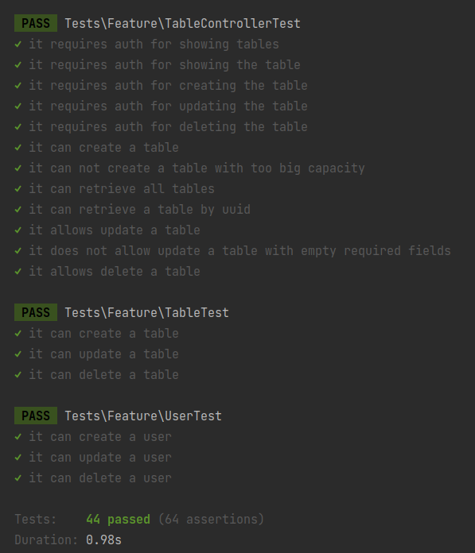

# Ballast lane test project

This is an application for booking tables in restaurants.
There are three models in the system: user, table and booking.
Authorized users can manage tables and bookings.
A booking exists only with a table, a many-to-one relationship.
Also, a booking has a many-to-one relationship with a user.
Tables exist separately and are linked to a booking when it is created.
You can find the API documentation below.

The project uses Docker, before you start, you **must** create a .env file (it's important).
You can simply copy .env.example.

If you have port `80` occupied, you can redefine it in the `APP_PORT` variable.

Run it for start using the app:

```shell
cp .env.example .env \
&& docker-compose up --build -d
```

After that you will have the app on your `APP_PORT`, by default is `80` [http://localhost/](http://localhost/).
There you can see greetings, all the endpoints work via `api`.
In the repository there is exported Postman collection here
[assets/Ballast_lane.postman_collection.json](https://github.com/createsites/ballast_lane_test/blob/master/assets/Ballast_lane.postman_collection.json). 

## Endpoints

| Method   | Description   | Endpoint                                              | Headers                                                     | Body (form-data)                                         | 
|----------|----------|-------------------------------------------------------|--------------------------------------------------------------|-----------------------------------------------------------|
| **GET**  | Display the registered user's info | `/api/profile`                                         | Authorization: Bearer Token <br> Content-Type: application/json <br> Accept: application/json | -                                                         | 
| **POST** | Registration | `/api/register`                                        | Content-Type: application/json <br> Accept: application/json | name: Test <br> email: test@example.com <br> password: secretpass | 
| **POST** | Login | `/api/login`                                           | Content-Type: application/json <br> Accept: application/json | email: test@example.com <br> password: secretpass           | 
| **POST** | Logout | `/api/logout`                                          | Authorization: Bearer Token <br> Content-Type: application/json <br> Accept: application/json | -                                                         | 
| **GET**  | Display all tables | `/api/tables`                                          | Authorization: Bearer Token <br> Accept: application/json <br> Content-Type: application/json | -                                                         | 
| **GET**  | Show the table info | `/api/tables/{table_id}`                               | Authorization: Bearer Token <br> Accept: application/json <br> Content-Type: application/json | -                                                         | 
| **POST** | Add a table | `/api/tables`                                          | Authorization: Bearer Token <br> Accept: application/json <br> Content-Type: application/json | capacity: 4 <br> location: Berlin                           | 
| **PUT**  | Update the table | `/api/tables/{table_id}`                               | Authorization: Bearer Token <br> Accept: application/json <br> Content-Type: application/json | location: New York                            | 
| **DELETE**| Delete the table | `/api/tables/{table_id}`                              | Authorization: Bearer Token <br> Accept: application/json <br> Content-Type: application/json | -                                                         | 
| **GET**  | Display all bookings | `/api/bookings`                                        | Authorization: Bearer Token <br> Accept: application/json <br> Content-Type: application/json | -                                                         | 
| **GET**  | Show the booking info | `/api/bookings/{booking_id}`                           | Authorization: Bearer Token <br> Accept: application/json <br> Content-Type: application/json | -                                                         | 
| **POST** | Add a booking | `/api/bookings`                                        | Authorization: Bearer Token <br> Accept: application/json <br> Content-Type: application/json | - | 
| **PUT**  | Update the booking | `/api/bookings/{booking_id}`                           | Authorization: Bearer Token <br> Accept: application/json <br> Content-Type: application/json | - | 
| **DELETE**| Delete the booking | `/api/bookings/{booking_id}`                          | Authorization: Bearer Token <br> Accept: application/json <br> Content-Type: application/json | -                                                         | 

## Run tests

```shell
docker exec ballast-app sh -c 'php artisan test'
```

### Tests result


